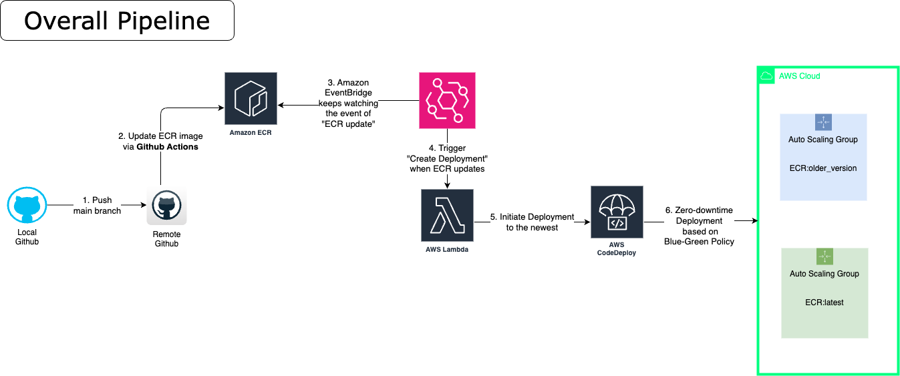

# Blue-Green Policy using CodeDeploy + ALB + EC2 AutoScaling Group

This script aims to pursue a blue-green deployment policy using CodeDeploy, ALB, and EC2 AutoScaling Group for non-stop service.

## Architecture


## Stack
- Every stack used in the [`tf-alb-asg`](https://github.com/letsjake/terraform-template/tree/main/tf-alb-asg) as well
- AWS CodeDeploy
- S3 Bucket(for appspec.zip)
- Github Actions(refer to `workflow.template.yml` and reflect it to `.github/workflows/[NAME].yml`)

## Prerequisites
* keypair: You should create your keypair first to the corresponding region.

## How to use
1. Create a terraform.tfvars file and fill in the variables. You can refer to the `terraform.tfvars.template` file.

2. Run the following commands:
```bash
terraform init
terraform plan
terraform apply -> yes
```

3. Check if AWS resource is created successfully
4. Push your changed code to the branch which you set in the Github Actions and check it works