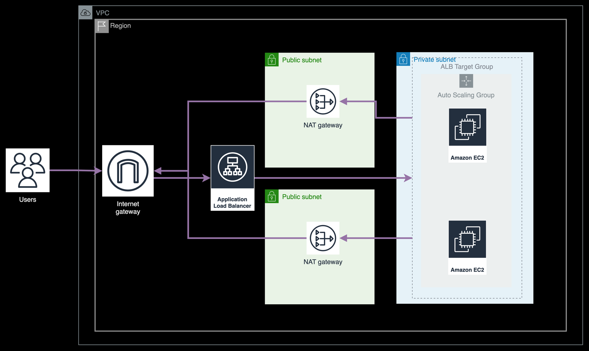

# ALB + EC2 AutoScaling Group

This terraform script consists of :
* VPC config
* subnet, AZ, IGW, Route Table, NAT config
* ALB
* EC2 AutoScaling Group
* Security Group
* ALB Target Group

## Architecture


## Prerequisites
* keypair: You should create your keypair first to the corresponding region.

## How to use
1. Create a terraform.tfvars file and fill in the variables. You can refer to the `terraform.tfvars.template` file.

2. Run the following commands:
```bash
terraform init
terraform plan
terraform apply -> yes
```